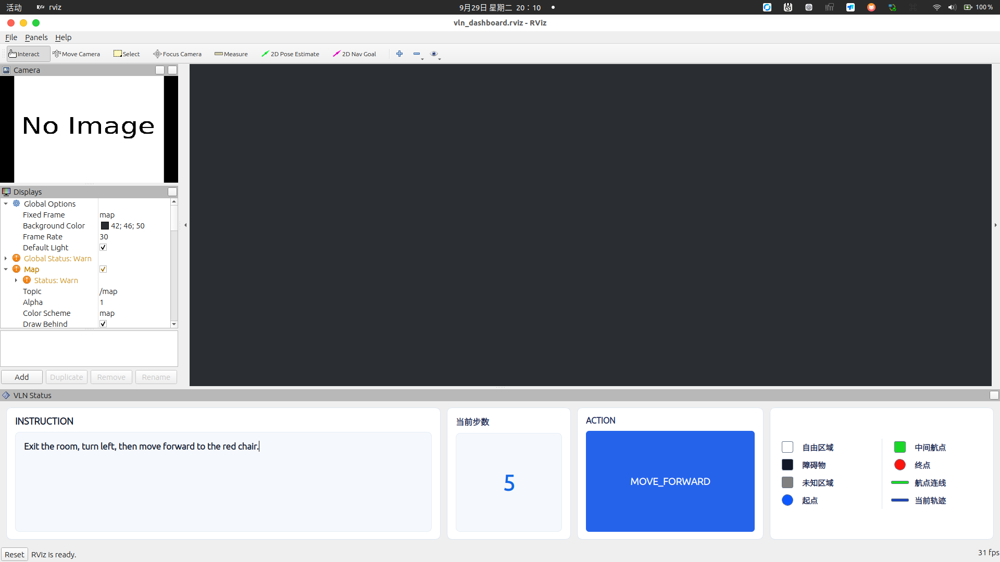

# RViz VLN dashboard



该包为 ROS1 Noetic 提供一个可停靠的 RViz Panel，在同一个 RViz 窗口中显示：

- 摄像头第一视角：RViz 原生 `Image`，默认 `/camera/rgb/image_raw`。
- 栅格地图和 URDF 小车：`/map`、`/robot_description` 和 TF。
- 当前运行轨迹：`/current_path`。
- 航点：`/waypoints/markers`。
- VLN 指令：直接在 RViz 面板的文本框内输入，不订阅 ROS topic。
- 当前 Action：订阅 `/vln/action`，类型为 `std_msgs/String`。
- 当前步数：面板启动时从 0 开始，每收到一条有效 Action 自动加 1。
- 栅格地图、航点和轨迹颜色图例。

RViz 原生 Display 负责订阅地图、轨迹、航点、相机和 RobotModel；
`VlnStatusPanel` 本身只订阅 Action，不订阅指令话题，也不解析 VLN 推理 metrics。

## 构建

```bash
cd ~/VLN
catkin_make
source devel/setup.zsh
```

## 启动

确保 RTAB-Map、摄像头、`robot_state_publisher` 和 VLN 推理已经启动，然后执行：

```bash
roslaunch rviz_vln_panel vln_dashboard.launch
```

默认会一并启动航点和当前轨迹节点。若它们已经在运行：

```bash
roslaunch rviz_vln_panel vln_dashboard.launch \
  start_waypoints:=false start_current_path:=false
```

摄像头 topic 不同时可以覆盖：

```bash
roslaunch rviz_vln_panel vln_dashboard.launch \
  camera_topic:=/camera/rgb/image_color
```

Action topic 不同时可以覆盖：

```bash
roslaunch rviz_vln_panel vln_dashboard.launch action_topic:=/your/action
```

启动 RViz 后，直接点击 `VLN INSTRUCTION` 文本框输入导航指令。
面板接受纯 Action 字符串，也兼容带 `action` 字段的 JSON：

```bash
rostopic pub -1 /vln/action std_msgs/String "data: 'MOVE_FORWARD'"
rostopic pub -1 /vln/action std_msgs/String 'data: '\''{"version":1,"sequence":2,"action":"TURN_LEFT"}'\'''
```

面板每次加载时步数都重置为 0，不需要修改 VLN 推理源码。

`VLN Status` 首次加载后会自动停靠在 RViz 底部。可以将 `Camera` 图像窗口拖到左侧，
再使用 `File -> Save Config As` 保存你偏好的窗口比例和停靠布局。

## 手动添加面板

在任意 RViz 中选择：

```text
Panels -> Add New Panel -> rviz_vln_panel/VlnStatusPanel
```

URDF 本身不提供定位。RobotModel 的地图位置依赖可用的 `map -> base_link` TF。
